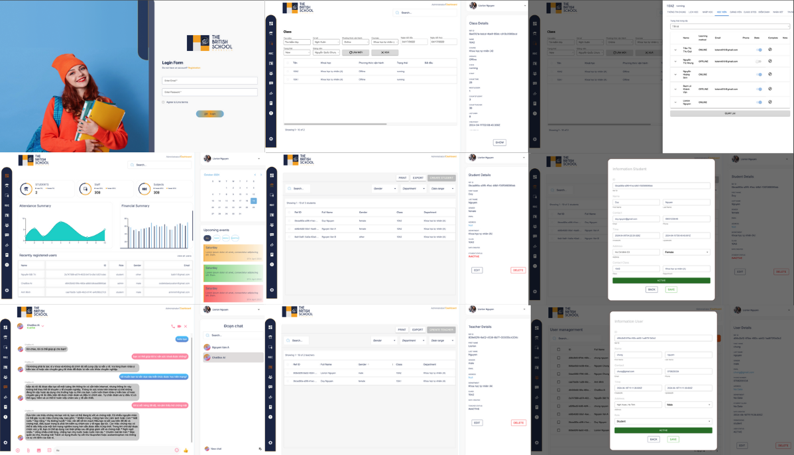

# Dự án Academy Manager

Dự án "Academy Manager" là một hệ thống quản lý trường học, cung cấp các chức năng quản lý lớp học, học sinh, giảng viên, cùng với tính năng chatbox và tin nhắn.

## Mô tả dự án

Hệ thống này được thiết kế để cung cấp một nền tảng quản lý toàn diện, cho phép người dùng quản lý quá trình học tập và giảng dạy một cách hiệu quả. Academy Manager không chỉ giúp người dùng theo dõi tiến độ học tập mà còn cung cấp các công cụ giao tiếp giữa học sinh và giảng viên.

Academy Manager hoạt động tốt trên cả máy tính để bàn và thiết bị di động, mang đến trải nghiệm quản lý linh hoạt cho người dùng.

**Các tính năng chính:**
- Quản lý lớp học và học sinh.
- Quản lý giảng viên và khóa học.
- Tính năng chatbox và gửi tin nhắn giữa học sinh và giảng viên.

## Công nghệ sử dụng:
* [Next.js](https://nextjs.org/): Framework React cho việc phát triển ứng dụng web.
* [NestJS](https://nestjs.com/): Framework cho Node.js, giúp xây dựng ứng dụng server-side.
* [Redux](https://redux.js.org/): Thư viện quản lý trạng thái cho ứng dụng React.
* [PostgreSQL](https://www.postgresql.org/): Hệ quản trị cơ sở dữ liệu mã nguồn mở, cho phép lưu trữ và quản lý dữ liệu một cách hiệu quả.
* [WebSocket](https://developer.mozilla.org/en-US/docs/Web/API/WebSocket): Giao thức cho phép giao tiếp hai chiều giữa client và server.

## [Figma](https://www.figma.com/design/uBO1X7QeIlv9Bj3EmRFlmq/School-Management-System-(Community))

# Demo
[(./)](public/Images/screens/demo.mp4)